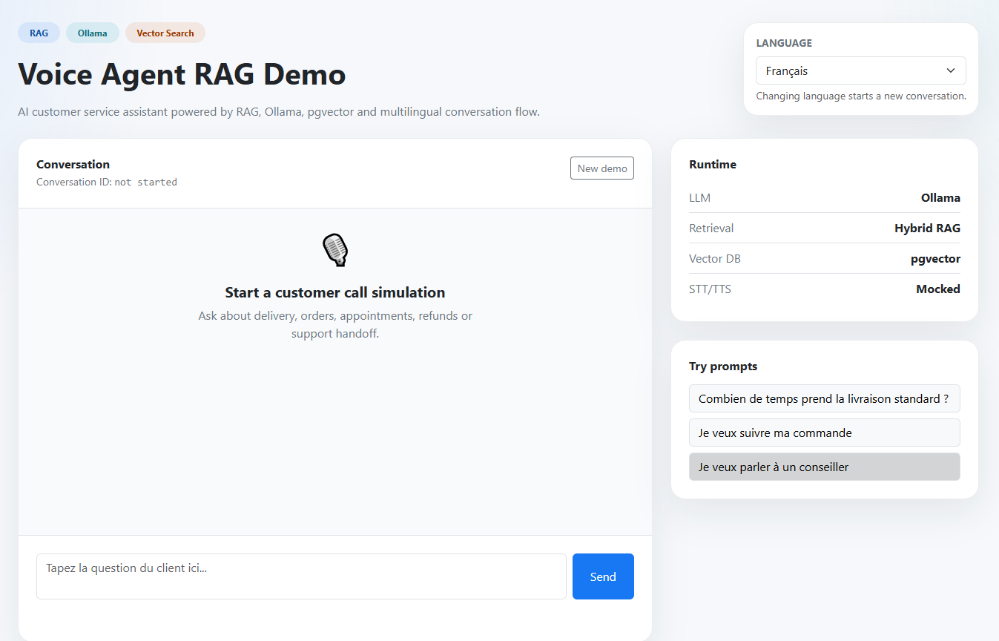
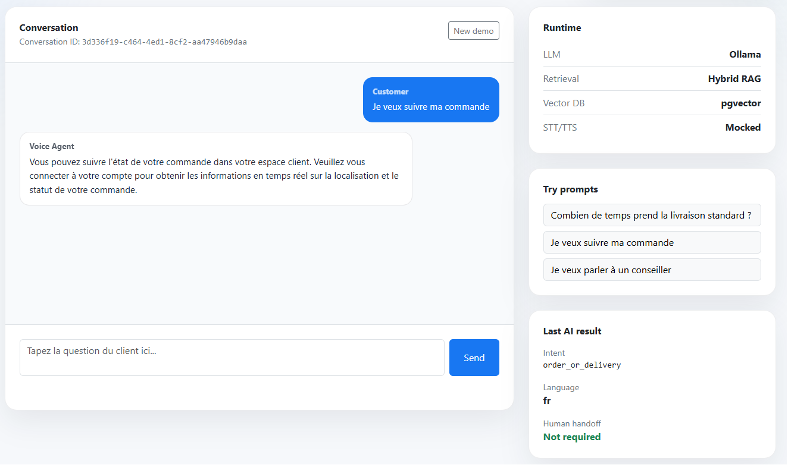
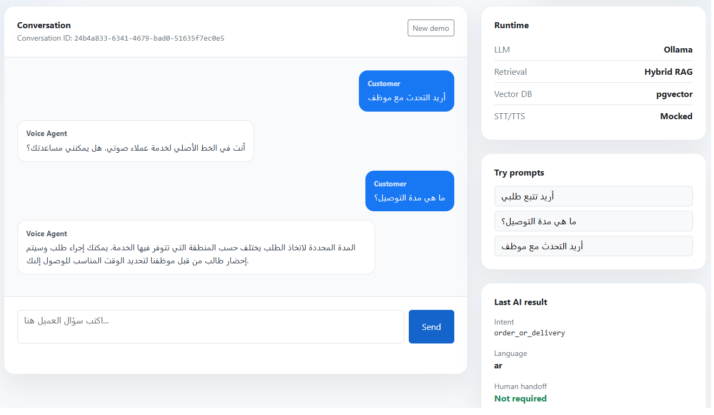
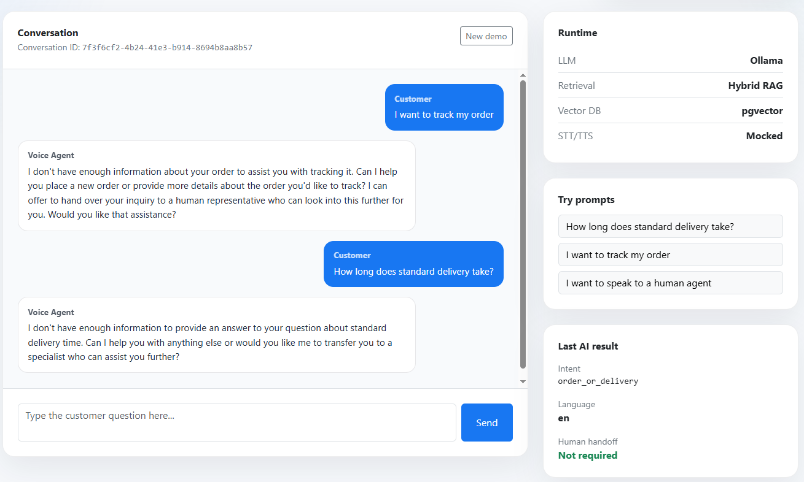
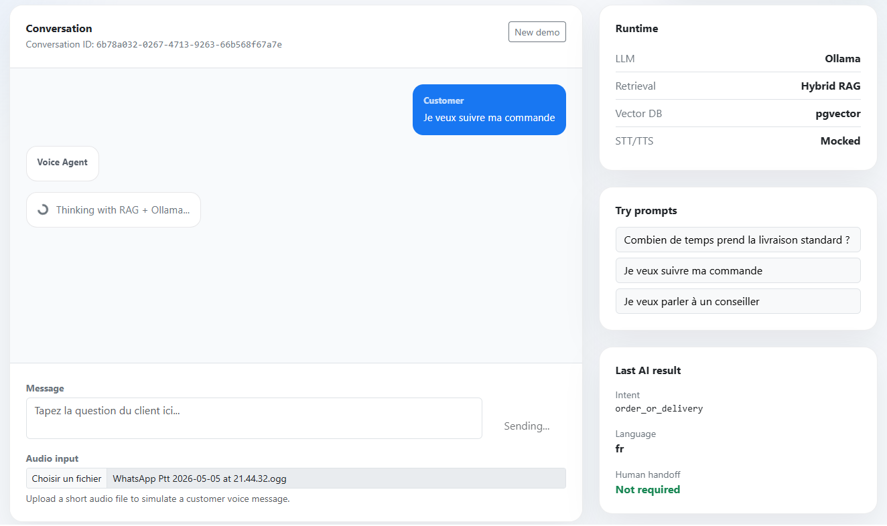
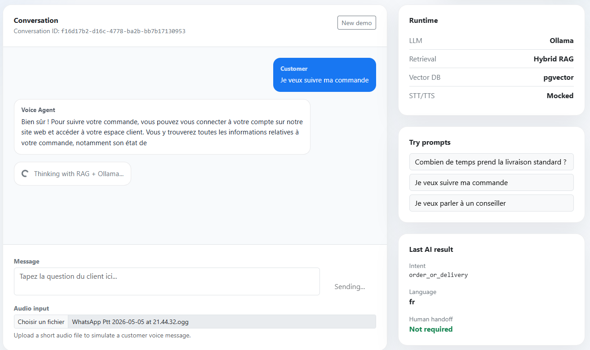
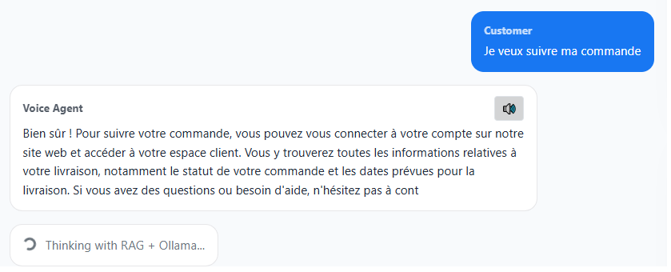

# Voice Agent RAG

Voice Agent RAG est un agent vocal intelligent pour l’automatisation du service client.

Le système écoute un utilisateur, convertit la voix en texte, comprend l’intention, recherche les informations pertinentes dans une base de connaissance via RAG, puis génère une réponse naturelle pouvant être reconvertie en audio.

---

## Démo

### Interface Blazor

Une interface de démonstration permet de simuler un agent de service client.

Fonctionnalités :
- Multilingue (FR / EN / AR)
- Gestion de conversation
- RAG hybride (vectoriel + mots-clés + reranking)
- LLM local via Ollama
- Réponses en temps réel

### Screenshot

#### Démo upload audio

---

## Objectifs

- Entrée vocale (Speech-to-Text)
- Détection d’intention
- Recherche documentaire avec RAG
- Génération de réponse en langage naturel
- Sortie vocale (Text-to-Speech)
- Historique des conversations
- Transfert vers un humain

---

## Architecture

Entrée audio
→ Speech-to-Text
→ Détection d’intention
→ RAG / Base de connaissance
→ Génération de réponse (LLM)
→ Text-to-Speech
→ Sortie audio

---

## Stack technique

- .NET 8 / ASP.NET Core Web API
- PostgreSQL + pgvector
- :contentReference[oaicite:2]{index=2} (LLM local)
- Blazor (UI de démo)
- STT / TTS (simulés pour le MVP)

---

## Structure du projet

src/
VoiceAgentRag.Api
VoiceAgentRag.Application
VoiceAgentRag.Contracts
VoiceAgentRag.Domain
VoiceAgentRag.Infrastructure
VoiceAgentRag.Demo

---

## Approche d’architecture

Ce projet suit une approche **architecture-first**.

Architecture d’abord
→ Pipeline validé
→ Puis intégration LLM

### Pourquoi cette approche ?

- Architecture propre et testable
- Pas de dépendance forte à un provider IA
- Validation complète du pipeline RAG indépendamment du LLM
- Facilité de changement de provider (Ollama, OpenAI, Azure…)

---

## État actuel (MVP)

Le système supporte désormais :

- Ingestion documentaire et découpage en chunks
- **Recherche vectorielle avec pgvector**
- **RAG hybride (vectoriel + mots-clés + reranking)**
- Conversations multilingues (FR / EN / AR)
- Détection d’intention (rule-based)
- **Génération de réponse via Ollama**
- Pipeline vocal (STT + TTS simulés)
- Persistance des conversations
- UI de démonstration (Blazor)
- API propre avec ProblemDetails

---

## Pipeline RAG

Requête utilisateur
→ Embedding (Ollama)
→ Recherche vectorielle (pgvector)
→ Recherche mots-clés
→ Reranking hybride
→ Sélection du contexte
→ Génération de réponse (LLM)

Cette approche améliore :

- compréhension sémantique
- robustesse aux reformulations
- précision des réponses

---

## Intégration LLM

Le système utilise :contentReference[oaicite:3]{index=3} comme LLM local.

Fonctionnalités :
- Réponses contextualisées via RAG
- Support multilingue
- Contrôle via prompt
- Exécution locale

Providers supportés :

Fake → Ollama → OpenAI → Azure

---

## UI de démonstration

Application Blazor incluse :

src/VoiceAgentRag.Demo

Fonctionnalités :
- Interface chat
- Changement de langue
- Persistance conversation
- Suggestions de prompts
- Diagnostic (intent, handoff)

---

## Périmètre MVP

Entrée texte ou audio
→ transcription
→ recherche RAG
→ réponse IA
→ sortie vocale optionnelle

L’intégration téléphonique pourra être ajoutée plus tard (Twilio, SIP, Asterisk…)

---

## Auteur

Rachid Bariz